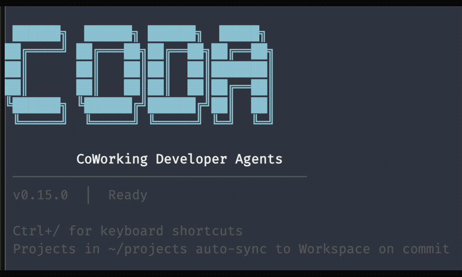
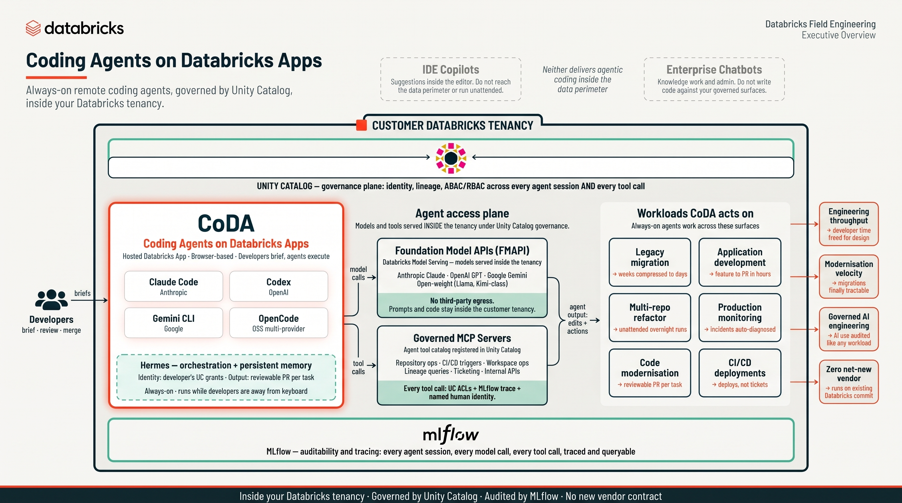
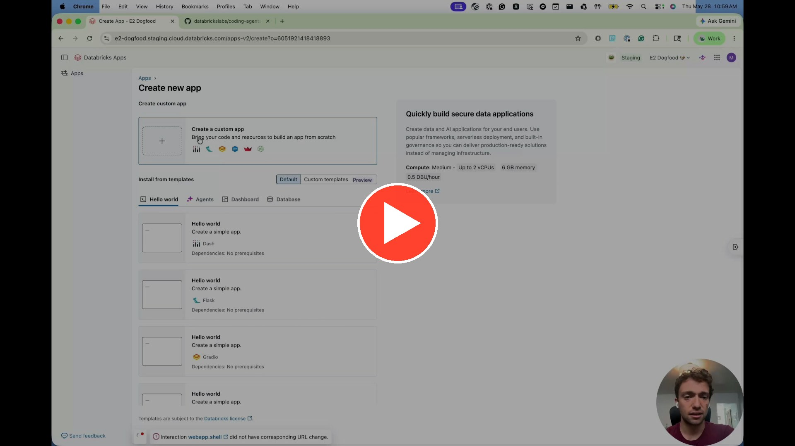

# Coding Agents on Databricks Apps


[](https://github.com/datasciencemonkey/coding-agents-databricks-apps/generate)
[](docs/deployment.md)
[](#whats-inside)
[](#-all-39-skills)

> Run Claude Code, Codex, Gemini CLI, Hermes Agent, and OpenCode in your browser — zero setup, wired to your Databricks workspace.

---

## 💬 Project Support

Please note that this project is provided for your exploration only and is not
formally supported by Databricks with Service Level Agreements (SLAs). It is
provided AS-IS, and we do not make any guarantees. Please do not submit a
support ticket relating to any issues arising from the use of this project.

Any issues discovered through the use of this project should be filed as GitHub
[Issues on this repository](https://github.com/databrickslabs/coding-agents-databricks-apps/issues).

See [LICENSE.md](LICENSE.md) for full terms, including the warranty disclaimer
and limitation of liability. See [NOTICE.md](NOTICE.md) for third-party software
attribution.

---

<div align="center">
  <video src="https://github.com/user-attachments/assets/40405b46-532a-4f14-82e3-414cb3744684" controls width="900"></video>
</div>

## Screenshots

<div align="center">
  
</div>

---

## Architecture

<div align="center">
  
</div>

CoDA runs as a hosted Databricks App inside your tenancy, alongside **Genie Code** — Databricks' in-product AI coding agent that lives in notebooks, the SQL editor, and dashboards. Genie Code is the interactive in-product surface; CoDA is the always-on hosted-app surface where Developers brief the agents through the browser and Claude Code, Codex, Gemini CLI, and OpenCode execute alongside the Hermes orchestrator. Both surfaces share the same access plane: every model call routes through Foundation Model APIs (no third-party egress) and every tool call routes through Governed MCP Servers (Unity Catalog ACLs + MLflow trace + named human identity). The result: agentic coding for legacy migration, application development, multi-repo refactor, production monitoring, code modernisation, and CI/CD deployments — all governed like any other workload.

---

## What's Inside

🟠 **Claude Code** — Anthropic's coding agent with 39 Databricks skills + 2 MCP servers

🟣 **Codex** — OpenAI's coding agent, pre-configured for Databricks

🔵 **Gemini CLI** — Google's coding agent with shared skills

🟡 **Hermes Agent** — NousResearch's multi-provider AI CLI with tool-calling and skills

🟢 **OpenCode** — Open-source agent with multi-provider support

Every agent installs at boot and connects to your **Databricks AI Gateway** — on first terminal session, paste a short-lived PAT and all CLIs are configured automatically. Token auto-rotates every 10 minutes.

### 📺 Setup walkthrough (6 min)

Want to see CoDA installed and running end-to-end? Click the thumbnail to watch the full walkthrough on YouTube.

<div align="center">
  <a href="https://youtu.be/ofqBQ26_e9o">
    
  </a>
</div>

---

## Why Databricks

This isn't just a terminal in the cloud. Running coding agents on Databricks gives you enterprise-grade infrastructure out of the box:

| | Benefit | What you get |
|---|---|---|
| 🔐 | **Unity Catalog Integration** | All data access governed by UC permissions — agents can only touch what your identity allows |
| 🤖 | **AI Gateway** | Route all LLM calls through a single control plane — swap models, set rate limits, and manage API keys centrally |
| 🔀 | **Multi-AI & Multi-Agent** | Switch between Claude, GPT, Gemini, and open-source models on the fly — change the model or agent without redeploying |
| 📊 | **Consumption Monitoring** | Track token usage, cost, and latency per user and per model via the AI Gateway control center dashboard |
| 🔍 | **MLflow Tracing** | Every Claude Code session is automatically traced — review prompts, tool calls, and outputs in your MLflow experiment |
| 🧬 | **Assess Traces with Genie** | Point Genie at your MLflow traces to ask natural-language questions about agent behavior, cost patterns, and session quality |
| 📝 | **App Logs to Delta** | Optionally route application logs to Delta tables for long-term retention, querying, and dashboarding |

---

## Terminal Features

| | |
|---|---|
| 🎨 **8 Themes** | Dracula, Nord, Solarized, Monokai, GitHub Dark, and more |
| ✂️ **Split Panes** | Run two sessions side by side with a draggable divider |
| 🌐 **WebSocket I/O** | Real-time terminal output over WebSocket — zero-latency, eliminates polling delay |
| 🔁 **HTTP Polling Fallback** | Automatic fallback via Web Worker when WebSocket is unavailable |
| 🚀 **Parallel Setup** | 7 agent setups run in parallel (~5x faster startup) |
| 🔍 **Search** | Find anything in your terminal history (Ctrl+Shift+F) |
| 🎤 **Voice Input** | Dictate commands with your mic (Option+V) |
| 📋 **Image Paste** | Paste or drag-and-drop images into the terminal — saved to `~/uploads/`, path inserted automatically |
| ⌨️ **Customizable** | Fonts, font sizes, themes — all persisted across sessions |
| 🔄 **Workspace Sync** | Every `git commit` auto-syncs to `/Workspace/Shared/coda/{app-name}/` |
| ✏️ **Micro Editor** | Modern terminal editor, pre-installed |
| ⚙️ **Databricks CLI** | Installed at boot, configured interactively on first session |
| 📊 **MLflow Tracing** | Every Claude Code session is automatically traced to your Databricks MLflow experiment |

---

## MLflow Tracing

Claude Code and Codex sessions can both be **automatically traced** to a single Databricks MLflow experiment — flip one switch to turn them on.

Claude Code can also export native OpenTelemetry signals to Unity Catalog tables. Set `CLAUDE_CODE_OTEL_ENABLED=true` and `CLAUDE_CODE_OTEL_CATALOG_SCHEMA=<catalog>.<schema>` to send spans, logs, and metrics to `claude_otel_spans`, `claude_otel_logs`, and `claude_otel_metrics` in that schema. Create those three target tables before enabling the flag.

### Turning it on

Set **`MLFLOW_TRACING_ENABLED=true`** in `app.yaml` (or your shell for local dev). That single variable enables tracing for both CLIs. Tracing is **off by default** to keep deploys lightweight — opt in when you want it.

```yaml
# app.yaml
env:
  - name: MLFLOW_TRACING_ENABLED
    value: "true"
```

### How it works

```
MLFLOW_TRACING_ENABLED=true
        │
        ├──► Claude Code: Stop hook fires on session end →
        │     mlflow.claude_code.hooks.stop_hook_handler() logs the transcript
        │
        └──► Codex: @mlflow/codex notify hook fires after each turn →
              trace appended to the experiment
```

Both land in the same MLflow experiment, so you can compare runs across agents side by side.

### Where traces live

```
/Users/{your-email}/{app-name}
```

For example, if you're `jane@company.com` and your app is named `coding-agents`:

```
/Users/jane@company.com/coding-agents
```

View them in the Databricks UI: **Workspace > Machine Learning > Experiments**.

### Configuration

Tracing is wired up during app startup:

| Setting | Value | Purpose |
|---------|-------|---------|
| `MLFLOW_TRACING_ENABLED` | `true`/`false` (default `false`) | Master switch for Claude + Codex |
| `MLFLOW_CLAUDE_TRACING_ENABLED` | mirrors `MLFLOW_TRACING_ENABLED` | Gates Claude's Stop hook at runtime |
| `MLFLOW_TRACKING_URI` | `databricks` | Routes traces to the Databricks backend |
| `MLFLOW_EXPERIMENT_NAME` | `/Users/{owner}/{app}` | Target experiment path |
| `MLFLOW_EXPERIMENT_ID` | resolved from name | Set in `~/.codex/.env` (Codex needs an ID) |

Tracing setup is skipped gracefully when `APP_OWNER` is not set (e.g., local dev without Databricks) or when `MLFLOW_TRACING_ENABLED` is left at its default `false`.

---

## Omnigent Host Integration

CoDA can register itself as a persistent **[Omnigent](https://github.com/omnigent-ai/omnigent) agent host** — an always-on target the Omnigent server can drive coding-agent sessions into. Those sessions run *inside this container* and use the same filesystem as browser terminals. They authenticate to Databricks as the CoDA app service principal, not as the interactive browser user, so their Unity Catalog authority may differ. A deployed CoDA app becomes both an interactive terminal **and** a headless host that survives restarts and redeploys.

**Off by default.** With `OMNIGENTS_SERVER_URL` unset, none of this runs and CoDA behaves exactly as before. This is opt-in, environment-specific wiring — the committed `app.yaml` keeps it commented out.

### Turning it on

Set three variables in your deployed `app.yaml` (see `app.yaml.lakemeter` for a ready-to-copy overlay template):

```yaml
# app.yaml
env:
  # The Omnigent server this app registers against on boot.
  - name: OMNIGENTS_SERVER_URL
    value: "https://<your-omnigent-app>.<region>.databricksapps.com"
  # UC Volume holding the omnigent host wheels (app SP needs READ_VOLUME).
  - name: OMNIGENTS_WHEEL_SPEC
    value: "/Volumes/<catalog>/<schema>/artifacts/wheels"
  # Optional: force-reinstall the host CLI on boot while rolling out a new wheel.
  - name: OMNIGENTS_FORCE_REINSTALL
    value: "1"
```

Before deploying, grant the CoDA app service principal `CAN_USE` on the
Omnigent server app plus `USE_CATALOG`, `USE_SCHEMA`, `READ_VOLUME`, and
`WRITE_VOLUME` on the wheel-volume path. The repository's grant target applies
the complete prerequisite set:

```bash
make grant-omnigent-host PROFILE=<profile> APP_NAME=<coda-app>
```

On boot, `initialize_app()` calls `start_host()`, which — only when `OMNIGENTS_SERVER_URL` is set — installs the `omnigents host` CLI from the wheel volume and launches it as a supervised background process that dials the server over an outbound WSS tunnel.

### Two credentials, two jobs

The non-obvious part of this design is that the host uses **two separate credentials** (see `omnigents_host.py`):

```
┌─────────────────────── CoDA container ───────────────────────┐
│                                                              │
│  omnigents host  ──WSS tunnel──►  Omnigent server            │
│      │              (auth: app-SP OAuth token)               │
│      │                                                       │
│      └── spawns runner ──►  AI Gateway                       │
│                             (auth: CoDA's ANTHROPIC_* creds) │
└──────────────────────────────────────────────────────────────┘
```

* **Host tunnel and runners** authenticate to the server through short-lived app-SP OAuth tokens. CoDA captures the SP credentials before stripping them from the environment, keeps the client secret only in Flask process memory, and exposes fresh tokens through a loopback-only broker. The on-disk `[omnigents-host]` profile contains only the workspace host; spawned Omnigent runners receive a refresh command, not a static bearer or client secret.
* **Harness LLM** — the runner the host spawns authenticates to AI Gateway via CoDA's already-injected `ANTHROPIC_*` env. No new LLM credential is minted.

### Runtime controls

Beyond boot registration, the host can be driven at runtime:

| Endpoint | Method | Purpose |
|----------|--------|---------|
| `/api/omnigents-status` | GET | Host-integration state (FR-9 observability) |
| `/api/omnigent-host/status` | GET | Current runtime host state |
| `/api/omnigent-host/connect` | POST | Start a host tunnel for a supplied `server_url` |
| `/api/omnigent-host/disconnect` | POST | Stop the active host tunnel |
| `/api/omnigent-host/share` | POST | Share the SP-owned host with a connecting user |

### Related

`ENABLE_SP_APIKEYHELPER=true` enables the same loopback-broker boundary for agent gateway calls: helpers fetch short-lived app-SP OAuth tokens without persisting the SP client secret or a static token in terminal-visible configuration. It is **off by default**, because it also makes the service principal the identity behind every model call. The default (`CODA_MODEL_AUTH=pat`) signs model calls with the user's PAT instead, so inference is attributed to a real user rather than collapsing onto one principal — see [docs/auth-and-identity.md](docs/auth-and-identity.md).

---

## Quick Start

### Deploy to Databricks Apps

1. Click [**Use this template**](https://github.com/datasciencemonkey/coding-agents-databricks-apps/generate) to create your own repo
2. Go to **Databricks → Apps → Create App**
3. Choose **Custom App** and connect your new repo
4. Deploy
5. Open the app — paste a short-lived PAT when prompted on first terminal session

That's it. No secrets to configure, no pre-deployment setup.

[→ Full deployment guide](docs/deployment.md) — environment variables, gateway config, and advanced options.

### Run locally

1. Click [**Use this template**](https://github.com/datasciencemonkey/coding-agents-databricks-apps/generate) to create your own repo
2. Clone your new repo and run:

```bash
git clone https://github.com/<you>/<your-repo>.git
cd <your-repo>
uv run python app.py
```

Open [http://localhost:8000](http://localhost:8000) — type `claude`, `codex`, `gemini`, or `opencode` to start coding.

---

<details>
<summary><strong>🧠 All 41 Skills</strong></summary>

### Databricks Skills (27) — [ai-dev-kit](https://github.com/databricks-solutions/ai-dev-kit)

| Category | Skills |
|----------|--------|
| AI & Agents | agent-bricks, ai-functions, genie, mlflow-eval, model-serving |
| Analytics | aibi-dashboards, unity-catalog, metric-views |
| Data Engineering | declarative-pipelines, jobs, structured-streaming, synthetic-data-gen, zerobus-ingest |
| Development | bundles, app-apx, apps-python, python-sdk, config, execution-compute, spark-python-data-source |
| Storage | iceberg, lakebase-autoscale, lakebase-provisioned, vector-search |
| Reference | docs, dbsql, pdf-generation |
| Meta | refresh-databricks-skills |

### Superpowers Skills (14) — [obra/superpowers](https://github.com/obra/superpowers)

| Category | Skills |
|----------|--------|
| Build | brainstorming, writing-plans, executing-plans |
| Code | test-driven-dev, subagent-driven-dev |
| Debug | systematic-debugging, verification |
| Review | requesting-review, receiving-review |
| Ship | finishing-branch, git-worktrees |
| Meta | dispatching-agents, writing-skills, using-superpowers |

</details>

<details>
<summary><strong>🔌 2 MCP Servers</strong></summary>

| Server | What it does |
|--------|-------------|
| **DeepWiki** | Ask questions about any GitHub repo — gets AI-powered answers from the codebase |
| **Exa** | Web search and code context retrieval for up-to-date information |


</details>

<details>
<summary><strong>🏗️ Architecture</strong></summary>

```
┌─────────────────────┐  WebSocket    ┌─────────────────────┐
│   Browser Client    │◄═══════════►│   Gunicorn + Flask   │
│   (xterm.js)        │  (primary)    │   + Flask-SocketIO   │
│                     │───────────►│   (PTY Manager)      │
│                     │  HTTP Poll    │                     │
│                     │  (fallback)   │                     │
└─────────────────────┘               └─────────────────────┘
         │                                     │
         │ on first load                       │ on startup
         ▼                                     ▼
┌─────────────────────┐               ┌─────────────────────┐
│   Setup Progress    │               │   Background Setup  │
│   (inline UI)       │               │   (11 steps, 5→6 ║) │
└─────────────────────┘               └─────────────────────┘
                                               │
                                               ▼
                                      ┌─────────────────────┐
                                      │   Shell Process     │
                                      │   (/bin/bash)       │
                                      └─────────────────────┘
```

### Startup Flow

1. Gunicorn starts, calls `initialize_app()` via `post_worker_init` hook
2. App serves the terminal UI with inline setup progress
3. Background thread runs setup: 5 sequential steps (git config, micro editor, GitHub CLI, Databricks CLI upgrade, content-filter proxy), then 6 agent setups (Claude, Codex, OpenCode, Gemini, Databricks CLI config, MLflow) run in parallel via `ThreadPoolExecutor`
4. `/api/setup-status` endpoint reports progress to the UI
5. Once complete, the terminal becomes interactive

### API Endpoints

| Endpoint | Method | Description |
|----------|--------|-------------|
| `/` | GET | Terminal UI with inline setup progress |
| `/health` | GET | Liveness probe. Exempt from the SSO gate so the platform can reach it. Unauthenticated callers get only `{"status": "healthy"\|"degraded"}`; the owner additionally gets version, session count, setup status and PAT-rotator state |
| `/api/setup-status` | GET | Setup progress for the UI (owner-gated) |
| `/api/app-state` | GET | Persisted app state (owner, last rotation) (owner-gated) |
| `/api/version` | GET | App version |
| `/api/sessions` | GET | List active (non-exited) sessions with metadata |
| `/api/pat-status` | GET | Whether a valid, usable PAT is currently configured (owner-gated) |
| `/api/configure-pat` | POST | Interactive first-session PAT setup (owner-gated via SSO) |
| `/api/inject-pat` | POST | Programmatic PAT injection for scripted provisioning (shared-secret gated; disabled unless `CODA_BOOTSTRAP_SECRET` is set). Also requires a workspace **OAuth bearer** for the Apps edge — a PAT bearer 401s at the platform edge before reaching the app |
| `/api/session` | POST | Create new terminal session |
| `/api/session/attach` | POST | Reattach to an existing session (replays buffered output) |
| `/api/input` | POST | Send input to terminal |
| `/api/output` | POST | Poll for terminal output (single session) |
| `/api/output-batch` | POST | Batch poll output for multiple sessions |
| `/api/heartbeat` | POST | Lightweight keepalive (no buffer drain) |
| `/api/resize` | POST | Resize terminal dimensions |
| `/api/upload` | POST | Upload file (clipboard image paste) |
| `/api/session/close` | POST | Close terminal session |

### WebSocket Events (Socket.IO)

| Event | Direction | Description |
|-------|-----------|-------------|
| `join_session` | Client → Server | Join session room for output delivery |
| `leave_session` | Client → Server | Leave session room |
| `terminal_input` | Client → Server | Send keystrokes to PTY |
| `terminal_resize` | Client → Server | Resize terminal |
| `heartbeat` | Client → Server | Keepalive for idle sessions |
| `terminal_output` | Server → Client | Push PTY output in real time |
| `session_exited` | Server → Client | Shell process exited |
| `session_closed` | Server → Client | Session terminated by server |
| `shutting_down` | Server → Client | Server restarting (SIGTERM) |

</details>

<details>
<summary><strong>⚙️ Configuration</strong></summary>

### Environment Variables

| Variable | Required | Description |
|----------|----------|-------------|
| `HOME` | Yes | Set to `/app/python/source_code` in app.yaml |
| `DATABRICKS_TOKEN` | No | Optional. If not set, the app prompts for a token on first session (or use `/api/inject-pat`). Auto-rotated every 10 minutes |
| `CODA_BOOTSTRAP_SECRET` | No | Enables the `/api/inject-pat` endpoint and is the shared secret required to call it. Unset ⇒ endpoint returns 404. Use a distinct secret per CoDA when provisioning many. Run `setup_pat_provisioner.sh` once to create an OAuth service principal (with CAN_USE on the apps, `workspace-access`, and token rights), then `provision_coda_pats.sh` to bulk-inject. `provision_coda_pats.sh` mints PATs restricted to REST **API scopes** (platform-enforced). By default it grants **all safe scopes** (incl. `secrets` for lab config) and excludes the dangerous ones (`access-management`, `authentication`, `identity`, `scim`, `settings`, `global-init-scripts`, `networking`); override with `--scopes a,b,c` or `--all-scopes` |
| `CODA_INSTANCE_NAME` | No | Names this CoDA so auto-rotated PATs are tagged `coda-auto-rotated:<name>` (attribution when many CoDAs share one identity). Falls back to `DATABRICKS_APP_NAME`/app URL host |
| `DATABRICKS_GATEWAY_HOST` | No | AI Gateway URL override. Three distinct states: **unset** → derive from `DATABRICKS_WORKSPACE_ID` (or an Azure `DATABRICKS_HOST`) and probe for reachability — the default, and correct for most deploys; **set to a URL** → trusted with *no* probe, so a stale or placeholder value makes every model call fail with `400 Invalid Token`; **set to `""`** → explicitly disable the gateway and use `{DATABRICKS_HOST}/serving-endpoints` |
| `ANTHROPIC_MODEL` | No | Claude model name (default: `databricks-claude-opus-4-8`) |
| `PI_MODEL` | No | Pi model name — same `/anthropic` gateway route as Claude (default: `databricks-claude-opus-4-8`) |
| `ENABLE_PI` | No | Set `false` to skip installing the Pi coding agent (default: `true`) |
| `CODEX_MODEL` | No | Codex model name (default: `databricks-gpt-5-5`) |
| `GEMINI_MODEL` | No | Gemini model name (default: `databricks-gemini-2-5-pro`) |
| `HERMES_MODEL` | No | Hermes model name (default: `databricks-claude-opus-4-6`) |
| `HERMES_FALLBACK_MODEL` | No | Fallback model if `HERMES_MODEL` is unavailable in this workspace's geo |
| `ENABLE_HERMES` | No | Set to `"false"` to skip Hermes Agent install. Other CLIs are unaffected. Default `"true"` |
| `APP_OWNER_EMAIL` | No | Pin the app owner instead of resolving it from the Apps API. Useful when the app is created *on behalf of* someone (so `app.creator` is the wrong identity), or to remove the boot-time API call from the critical path entirely. Authorization fails closed while the owner is unresolved, so this is the deterministic escape hatch |
| `FLASK_SECRET_KEY` | No | Signs session cookies. Unset = a fresh random key per worker start, which invalidates existing sessions on every restart. Wire to a Databricks secret in production |
| `CODA_TELEMETRY_DISABLED` | No | Set to `"true"` to make `log_telemetry()` a no-op — no outbound telemetry to disclose in a third-party-risk review |
| `MAX_CONCURRENT_SESSIONS` | No | Cap on simultaneous PTY sessions per worker (default `5`) |
| `CLAUDE_CODE_DISABLE_AUTO_MEMORY` | No | Pass-through to Claude Code's auto-memory feature (default `0`) |
| `MLFLOW_TRACING_ENABLED` | No | Set to `"true"` to enable MLflow tracing for Claude, Codex, and Gemini in one switch (default `"false"`) |
| `CLAUDE_CODE_OTEL_ENABLED` | No | Set to `"true"` to enable Claude Code OTEL export to Unity Catalog (default `"false"`) |
| `CLAUDE_CODE_OTEL_CATALOG_SCHEMA` | No | Target `<catalog>.<schema>` for `claude_otel_spans`, `claude_otel_logs`, and `claude_otel_metrics` |
| `OMNIGENTS_SERVER_URL` | No | Omnigent server to register against on boot. Unset = host integration off (default). See [Omnigent Host Integration](#omnigent-host-integration) |
| `OMNIGENTS_WHEEL_SPEC` | No | UC Volume path holding the `omnigents host` wheels (app SP needs `READ_VOLUME`). Required when `OMNIGENTS_SERVER_URL` is set |
| `OMNIGENTS_FORCE_REINSTALL` | No | Set `"1"` to reinstall the host CLI on boot (for rolling out a new wheel); otherwise `uv tool install` no-ops on an existing binary |
| `ENABLE_SP_APIKEYHELPER` | No | Set `"true"` to broker short-lived app-SP OAuth tokens over loopback without persisting the client secret in terminal-visible configuration. Off by default — it makes the **service principal** the model-auth identity, which is the opposite of `CODA_MODEL_AUTH=pat` |
| `CODA_MODEL_AUTH` | No | Which identity signs agent model calls: `pat` (default) attributes inference to the real user, so AI Gateway usage tracking, cost attribution and per-user governance work; `sp` uses the app service principal for zero-PAT onboarding. The other is always the fallback. See [docs/auth-and-identity.md](docs/auth-and-identity.md) |
| `CODA_DISABLE_OWNER_CHECK` | No | Set `"true"` for a shared, trusted, time-boxed deployment: any authenticated workspace user may drive the terminal as the single injected identity. Off by default. Note it only opens the terminal + WebSocket — `configure-pat` and `omnigent-host/share` stay owner-only — and it means agent actions are attributed to the injected identity rather than to the person typing |
| `DEEPWIKI_MCP_URL` | No | Override or disable the DeepWiki MCP server (set to `""` to remove) |
| `EXA_MCP_URL` | No | Override or disable the Exa MCP server (set to `""` to remove) |
| `TEAM_MEMORY_MCP_URL` | No | Optional shared-org-memory MCP server URL |
| `ENTERPRISE_MODE` | No | When `"true"`, logs a banner and warns on missing recommended mirrors. See [enterprise docs](docs/enterprise.md) for the full enterprise contract (JFrog mirrors, custom CA bundle, corporate proxy, etc.) |

### Security Model

Single-user app — the owner is resolved via the app's service principal and Apps API (`app.creator`), with no PAT required at deploy time. Authorization checks `X-Forwarded-Email` against `app.creator`. On first terminal session, the user pastes a short-lived PAT interactively. Tokens auto-rotate every 10 minutes (15-minute lifetime), with old tokens proactively revoked. On restart, the user re-pastes (no persistence by design).

Each GitHub Release ships a signed CycloneDX SBOM — see [docs/SECURITY.md](./docs/SECURITY.md) for verification steps.

### Gunicorn

Production uses `workers=1` (PTY state is process-local), `threads=16` (concurrent polling + WebSocket), `gthread` worker class, `timeout=60` (long-lived WebSocket connections).

</details>

<details>
<summary><strong>📁 Project Structure</strong></summary>

```
coding-agents-databricks-apps/
├── app.py                       # Flask backend + PTY management + setup orchestration
├── app_state.py                 # Shared app state (setup progress, session registry)
├── app.yaml.template            # Databricks Apps deployment config template
├── cli_auth.py                  # Interactive PAT setup + CLI credential writer
├── content_filter_proxy.py      # Proxy that sanitises empty-content blocks for OpenCode
├── gunicorn.conf.py             # Gunicorn production server config
├── pat_rotator.py               # Background PAT auto-rotation (10-min cycle)
├── pyproject.toml               # Package metadata + uv config (supply-chain guardrails)
├── requirements.txt             # Compiled from pyproject.toml (Dependabot compatibility)
├── requirements.lock            # Hash-pinned lockfile (auto-regenerated by CI)
├── Makefile                     # Deploy, redeploy, status, and cleanup targets
├── setup_claude.py              # Claude Code CLI + MCP configuration
├── setup_codex.py               # Codex CLI configuration
├── setup_gemini.py              # Gemini CLI configuration
├── setup_opencode.py            # OpenCode configuration
├── setup_databricks.py          # Databricks CLI configuration
├── setup_mlflow.py              # MLflow tracing auto-configuration
├── setup_proxy.py               # Content-filter proxy startup
├── sync_to_workspace.py         # Post-commit hook: sync to Workspace
├── install_micro.sh             # Micro editor installer
├── install_gh.sh                # GitHub CLI installer (OS/arch-aware)
├── install_databricks_cli.sh    # Databricks CLI upgrade script
├── utils.py                     # Utility functions (ensure_https)
├── static/
│   ├── index.html               # Terminal UI (xterm.js + split panes + WebSocket)
│   ├── favicon.svg              # App favicon
│   ├── poll-worker.js           # Web Worker for HTTP polling fallback
│   └── lib/
│       ├── xterm.js             # xterm.js terminal emulator
│       └── socket.io.min.js     # Vendored Socket.IO client
├── .claude/
│   └── skills/                  # 39 pre-installed skills
├── .github/
│   └── workflows/
│       ├── dependency-audit.yml # Weekly CVE audit + lockfile drift check
│       └── update-lockfile.yml  # Auto-regenerate requirements.lock on push
└── docs/
    ├── deployment.md            # Full Databricks Apps deployment guide
    ├── prd/                     # Product requirement documents
    └── plans/                   # Design documentation
```

</details>

---

## Technologies

Flask · Flask-SocketIO · Socket.IO · Gunicorn · xterm.js · Python PTY · uv · Databricks SDK · Databricks AI Gateway · MLflow
